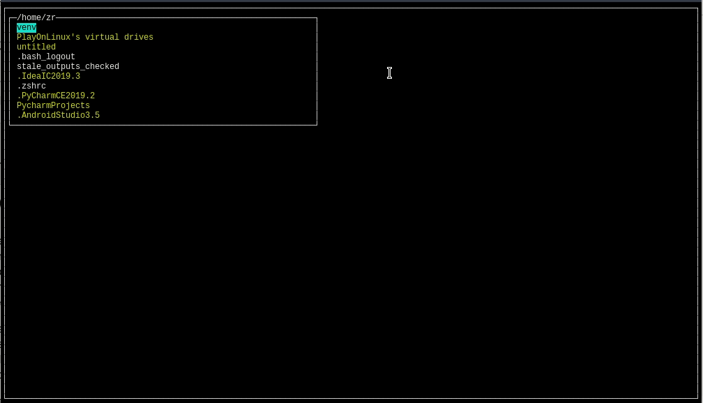

# Fast File Manager v0.1
Simple and Fast file manager written in Python3 (Tested only on Linux)

v0.2
- add filtering by clicking "/"
- we can cancel filtering by clicking ESC
- approve filter by ENTER or arrows: UP and DOWN

v0.1
- list files
- up/down - choose file
- enter/backspace - go child/parent directory

