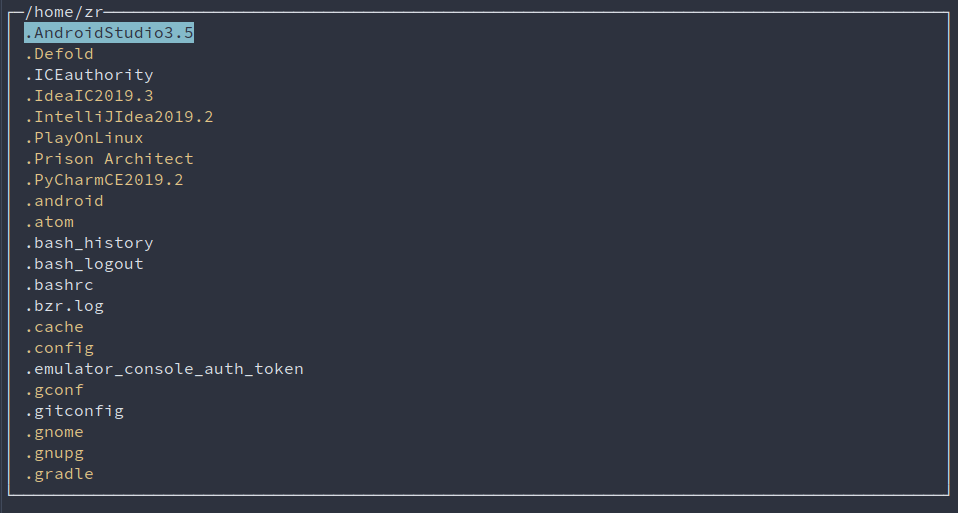

# Fast File Manager v0.3
Simple and Fast file manager written in Python3 (Tested only on Linux)

v0.3
-
- refactor (and add another mess in source code :D)
- "v" - we can split window
- "h", "l" - change focus for left/right window
- basic handling for changing terminal size during application working

v0.2
-
- add filtering by clicking "/"
- we can cancel filtering by clicking ESC
- approve filter by ENTER or arrows: UP and DOWN

v0.1
-
- list files
- up/down - choose file
- enter/backspace - go child/parent directory

